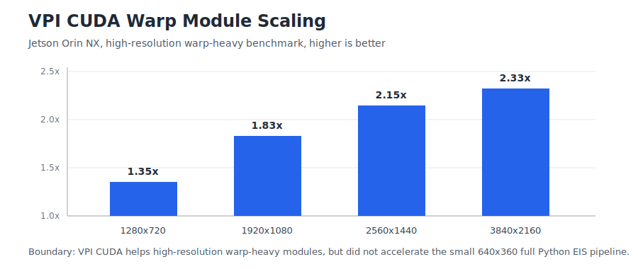

# Hardware Acceleration Boundary

## VPI Full-Pipeline Result

Same-input `regular_gate05_regular_6` backend swap:

| Backend | avg_warp_ms | total_wall_time_s | Result |
|---|---:|---:|---|
| opencv_cpu | 7.936 | 8.473 | current best |
| vpi_cuda | 9.621 | 9.382 | slower |
| vpi_cpu | 11.934 | 9.640 | slower |
| vpi_vic | 14.531 | 10.132 | slower |

Conclusion:

```text
Simple VPI backend replacement does not accelerate the current 640x360 Python
full pipeline.
```

## VPI Module-Level Result

High-resolution warp-heavy benchmark:



| Resolution | OpenCV CPU ms | VPI CUDA ms | Speedup |
|---|---:|---:|---:|
| 1280x720 | 6.118 | 4.523 | 1.35x |
| 1920x1080 | 13.569 | 7.398 | 1.83x |
| 2560x1440 | 22.920 | 10.651 | 2.15x |
| 3840x2160 | 48.452 | 20.836 | 2.33x |

Conclusion:

```text
VPI CUDA helps when the warp workload is large enough to amortize conversion and
readback costs.
```

## GStreamer / NVMM Readiness

Minimum Jetson path reached EOS:

```text
filesrc -> qtdemux -> h264parse -> nvv4l2decoder -> NVMM -> nvvidconv -> BGRx -> fakesink
```

This proves dataflow readiness, not EIS acceleration.

Measured latency anchors:

| Case | EOS | Wall time |
|---|---|---:|
| decode/NVMM/convert/fakesink, avg of 3 | 3/3 | 1.931 s |
| hardware encode path | 1/1 | 1.299 s |
| CPU-readable boundary | 1/1 | 1.960 s |
| Python appsink BGRx pull | 240 frames | 1.904 s / 7.93 ms per frame |

Interpretation:

```text
The Jetson dataflow path is available and measurable. Python appsink readback is
also measurable at about 7.93 ms/frame for this 1080p probe. The next step is an
appsrc/encode return path, not immediate EIS integration.
```

## Interview Wording

```text
I measured both where hardware acceleration fails and where it starts to help.
In the small Python EIS pipeline, VPI was slower because conversion and
synchronization dominated. In a high-resolution warp module, VPI CUDA scaled well
and reached 2.33x at 4K. The next step is measuring a real NVMM dataflow boundary
before trying to integrate it into EIS.
```

## Evidence

```text
docs/vpi_warp_module_report_2026-07-18.md
docs/gstreamer_nvmm_latency_plan_2026-07-18.md
results/gst_nvmm_decode_convert_latency_20260718/summary.md
results/gst_nvmm_decode_convert_latency_20260718/appsink_summary.csv
results/perf_backend_compare_20260718/backend_compare_summary.md
results/vpi_resolution_scaling_benchmark/vpi_module_summary.md
results/gst_nvmm_probe_20260718_summary.md
```
